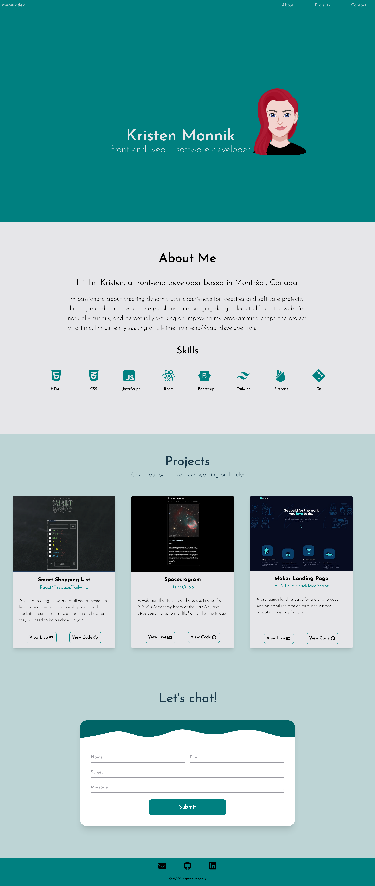

# Portfolio page

Responsive website showcasing software development projects and features an email contact form. Designed and built by Kristen Monnik.

## Table of contents

- [Overview](#overview)
  - [Screenshot](#screenshot)
  - [Links](#links)
- [My process](#my-process)
  - [Built with](#built-with)
  - [What I learned](#what-i-learned)
  - [Future Enhancements](#future-enhancements)
  - [Useful resources](#useful-resources)
- [Author](#author)

## Overview

### Screenshot

### Links

-  [GitHub Repo](https://github.com/k-monnik/react-portfolio)
-  Live Site: [monnik.dev](https://monnik.dev)

## My Process

### Built with

- [React](https://reactjs.org/) - JS library
- [Tailwind CSS](https://tailwindcss.com) - CSS framework
- Flexbox
- CSS Grid
- Mobile-first workflow

### What I learned

This project challenged me with a few new things that I was experimenting with for the first time.

- Design: I don't consider myself a designer, but I wanted to try building a project that was my own design from scratch. I had a few ideas that I incorporated, but mainly I wanted to keep it sleek and simple. I chose a color palette and created a very basic wireframe and went from there. I'll most likely be making updates to this every once in a while :sweat_smile:

- Contact Form: For some reason, I thought that building a contact form that actually sends the message to an email inbox would be a Herculean task, but thank goodness for tools like EmailJS. Making this form user-friendly and accessible while maintaining a modern and responsive design were my top priorities, and I'm happy with how it turned out.

- More React: I wanted to continue growing my React + Tailwind skills, and this was the perfect opportunity to challenge myself with features like nested components, react router, smooth scrolling, and a hamburger menu.

### Future Enhancements

Features currently under development include dark mode, French translation toggle, and gif previews for the projects section. Check back soon!

### Useful resources

- [EmailJS](https://www.emailjs.com/) - Handy dandy email integration API that I used to connect my contact form to my email inbox.
- [Haikei App](https://haikei.app/) - Fun tool used to create a unique svg to make my contact form more artsy.
- [React Icons](https://react-icons.github.io/react-icons/) - An easy way to import icons into a React project
- [Avatar Maker](https://avatarmaker.com/) - I used this to make my avatar for the hero section.
- [Coolors](https://coolors.co/) - This is a really helpful tool when trying to design a color palette for a project. There's also a contrast checker tool to ensure your color combinations are accessible.

## Author

- Website - [Kristen Monnik](https://www.monnik.dev)
- Frontend Mentor - [@k-monnik](https://www.frontendmentor.io/profile/k-monnik)
- Twitter - [@kmonnik_dev](https://twitter.com/kmonnik_dev)
- GitHub - [@k-monnik](https://github.com/k-monnik)

